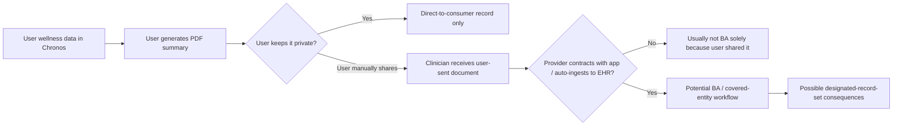
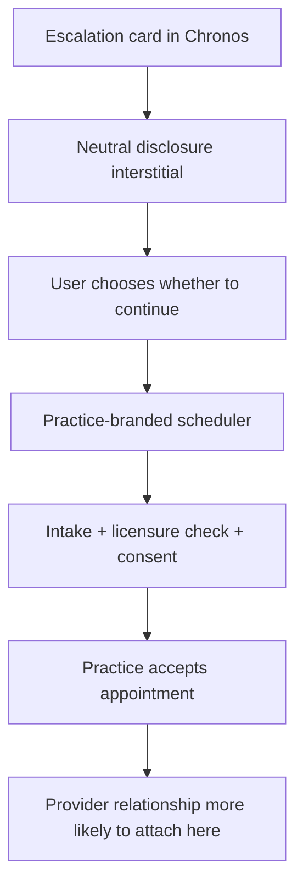

# Chronos escalation-screen legal research memorandum for counsel

## Executive summary

This memorandum is research for counsel, not legal advice. On the current facts, the biggest legal lever is **objective intended use**, not the label “wellness app” alone. FDA’s current general-wellness framework still leaves room for a neutral prompt that says a user **may want to talk with a healthcare professional**, but it does **not** leave room for language or workflows that recommend specific clinical action, describe outputs as abnormal or diagnostic, or otherwise guide medical management. At the state level, California, New York, and Texas all keep broad practice-of-medicine boundaries, which means provider-specific wording, medical-necessity framing, red-flag urgency, or automatic routing into a physician-booking flow increases risk even if no diagnosis is shown. citeturn22view2turn22view3turn9search0turn11view1turn35view1turn3view1turn36search0

My bottom-line risk view is: **Question one: Medium**, **Question two: Medium**, **Question three: Medium**, **Question four: Medium to High**, and **Question five: Medium**. The safest near-term product posture is to keep Page 4 as a **data-duration observation** only, replace “physician” with “healthcare professional,” remove any wording that implies “medical attention” or medical necessity, keep the disclaimer **above and adjacent to** the prompt, prohibit auto-scheduling from the escalation card, label any export as a **consumer-generated wellness tracking summary**, and ensure any provider-booking commercialization is not paid on a per-referral or per-booked-patient basis. HIPAA will usually not apply to the direct-to-consumer app by default, but FTC Act, FTC Health Breach Notification Rule, and state unfair/deceptive-practice laws still can. citeturn23view0turn23view2turn38view0turn38view1turn26view1turn14search1turn13search0turn12search6

## Regulatory baseline

Two federal anchors matter most here. First, 21 U.S.C. § 360j(o)(1)(B) excludes certain software functions “for maintaining or encouraging a healthy lifestyle” when they are unrelated to diagnosis, cure, mitigation, prevention, or treatment of disease. Second, FDA’s current general-wellness guidance says products lose that posture when their UI, advertising, or functionality includes disease references, diagnostic thresholds, or prompts that recommend specific clinical action or medical management. The same guidance also says a product may still remain in the general-wellness lane if it merely notifies a user that evaluation by a healthcare professional may be helpful, so long as it does not name a disease, characterize the output as abnormal/pathological/diagnostic, include treatment recommendations, or provide ongoing disease-management alerts. Intended use is judged by objective intent shown by labeling, design, and surrounding circumstances, not only by a disclaimer. citeturn11view1turn22view0turn22view3turn9search0

Outside HIPAA, consumer-health apps remain heavily regulated by the FTC and state consumer-protection law. HHS and FTC expressly warn that companies collecting health information may have obligations under the FTC Act and the FTC Health Breach Notification Rule even when HIPAA does not apply. The HBNR now expressly covers unauthorized acquisition caused by an unauthorized disclosure, and FTC enforcement actions against health apps have focused on health-data sharing, buried disclosures, and inconsistency between privacy promises and actual practice. citeturn38view0turn38view1turn38view2turn26view1turn14search1turn13search0turn12search6

## Referral language and the practice of medicine

| Risk | Primary legal drivers | Recommended immediate action |
|---|---|---|
| Medium | Broad state practice-of-medicine definitions; FDA intended-use rules; unfair/deceptive-claims risk | Replace “your physician” with “a healthcare professional,” frame the message as based **only** on tracked duration, and avoid urgency, specialty, abnormality, or treatment language. |

**Short answer.** A generic prompt such as “this pattern has been consistent for N days; you may want to discuss it with a healthcare professional” is materially safer than “worth a conversation with your physician,” and on the present facts is **less likely** to be treated as unlicensed practice than language that sounds like triage, referral, or clinical direction. But it is not risk-free, because New York and Texas define practicing medicine broadly, and California’s Medical Practice Act is also broad enough that counsel should review the final copy against urlCal. Bus. & Prof. Code § 2052https://leginfo.legislature.ca.gov/faces/codes_displaySection.xhtml?sectionNum=2052.&lawCode=BPC. citeturn35view1turn3view1turn36search0turn22view3

**Legal analysis.** New York defines the practice of medicine as “diagnosing, treating, operating or prescribing” for human disease, pain, injury, deformity, or physical condition, and only a licensed person may practice medicine or use the title “physician.” Texas defines “practicing medicine” to include diagnosis, treatment, or an offer to treat. FDA likewise draws a line between a wellness notification and a prompt that recommends specific clinical action or medical management. A neutral “consider discussing this with a healthcare professional” statement, explicitly tied to a user’s own trend duration and stripped of disease, abnormality, and urgency language, fits more comfortably on the non-clinical side of those lines than a provider-specific, physician-directed prompt does. citeturn35view1turn3view1turn36search0turn22view0turn22view3

**Suggested UI copy.**  
Primary card text: **“This wellness pattern has continued for [N] days based only on the trend you’ve been tracking. You may want to check in with a healthcare professional if you’d like help interpreting it.”**  
Secondary legal note: **“Chronos tracks wellness patterns. It does not diagnose conditions or recommend treatment.”** citeturn22view3turn38view1

**Questions for counsel and documents to review.** Counsel should review the escalation-rule specification, the ontology and `conditionClass` map, any internal copy deck that uses disease names or “escalation” language, the state licensure matrix, and any investor or marketing materials describing Page 4 as catching users who “need care.” Internal materials matter because intended use can be inferred from design and surrounding circumstances, not just what appears in the final UI. citeturn9search0turn22view3

## FDA general-wellness status under the escalation flow

| Risk | Primary legal drivers | Recommended immediate action |
|---|---|---|
| Medium | 21 U.S.C. § 360j(o)(1)(B); 21 C.F.R. § 801.4; FDA general-wellness guidance | Keep the output in the “helpful evaluation may be useful” lane; remove “medical attention” framing, disease nouns, thresholds, and any prompt that could be read as medical management. |

**Short answer.** The feature can likely remain within the federal general-wellness posture **if** the prompt stays informational and non-clinical. The safer framing is “evaluation by a healthcare professional may be helpful,” not “this warrants medical attention.” The latter sounds closer to a recommended clinical action. citeturn22view0turn22view3turn11view1

**Legal analysis.** FDA’s guidance now expressly says that wellness products are **not** general-wellness products if their UI or functionality includes alerts, alarms, or prompts that recommend or require specific clinical action or medical management. But the same guidance also says a product may still be a general-wellness product if it includes a notification that evaluation by a healthcare professional may be helpful, provided it does not name a disease, characterize the output as abnormal/pathological/diagnostic, include clinical thresholds or treatment recommendations, or provide ongoing disease-management alerts. Separately, FDA’s “intended use” regulation looks to objective intent shown by labeling, design, and surrounding circumstances. That means internal disease-oriented business decks, PRDs, Jira tickets, model labels, training materials, or QA scripts can matter if they show the feature is really meant to identify or manage disease. citeturn22view0turn22view3turn9search0turn11view1

**Suggested UI copy.**  
Primary card text: **“This wellness trend has remained at a similar level for [N] days. Because this message is based only on the duration of the trend you tracked, you may want to discuss it with a healthcare professional.”**  
Do **not** use: “warrants medical attention,” “abnormal,” “concerning findings,” “seek care,” “see your doctor now,” or disease-coded tooltip text. citeturn22view2turn22view3turn9search0

**Questions for counsel and documents to review.** Counsel should review the model-card documentation for the classifier, any disease-adjacent internal labels, the QA taxonomy, public FAQs, App Store copy, onboarding screens, and fundraising decks. The specific question is whether anything in those materials converts the feature from a trend-observation tool into a disease-screening, monitoring, or mitigation feature under 21 C.F.R. § 801.4. citeturn9search0turn22view3

## Exported summary, HIPAA status, and data-sharing risk

| Risk | Primary legal drivers | Recommended immediate action |
|---|---|---|
| Medium | 45 C.F.R. §§ 160.103, 164.501, 164.524; OCR app scenarios; FTC Act/HBNR | Rename the feature “Wellness Tracking Summary,” make sharing user-initiated only, add a cover-page disclaimer, and avoid automatic provider integration unless BA/covered-entity issues are resolved. |

**Short answer.** A user-generated PDF export is **usually not** a HIPAA medical record just because it is formatted for a clinician to read. HIPAA turns on whether the app is acting for a covered entity or business associate, and whether the records are maintained by or for a covered entity as part of a designated record set. If the app is direct-to-consumer and the user chooses to send a summary to a clinician, OCR says that alone does not make the developer a business associate. If, however, a provider contracts with the app for patient-management functions or automatic EHR ingestion, the business-associate analysis changes materially. citeturn8search0turn25search0turn23view0turn23view2

**Legal analysis.** The HIPAA definition of “designated record set” covers records maintained by or for a covered entity, including medical and billing records or other records used to make decisions about individuals. OCR’s app-developer scenarios draw a sharp line between consumer-directed use and covered-entity-directed use: when a user sends an app summary to a doctor, the developer is generally **not** a business associate solely for that reason; when the provider contracts with the developer for patient management, remote counseling, monitoring, messaging, or EHR integration, the developer **is** a business associate for that work. Even when HIPAA does not apply, HHS and FTC say the FTC Act and the HBNR may still apply to consumer health apps, including unauthorized disclosures. citeturn8search0turn8search8turn25search0turn23view2turn38view1turn38view2turn26view1

This data-flow split reflects OCR’s app scenarios and HIPAA’s definitions of business associate and designated record set. citeturn23view0turn23view2turn8search0turn25search0

**Suggested UI copy.**  
Button label: **“Export Wellness Tracking Summary”**  
Cover-page disclaimer: **“This document is a consumer-generated summary of wellness data you chose to track in Chronos. It is not a medical record, is not validated clinical testing, and does not diagnose, treat, or recommend treatment. A licensed healthcare professional should interpret it using their own clinical judgment.”** citeturn8search0turn23view2turn38view1

**Questions for counsel and documents to review.** Review any MBI integration documents, BA/DSA templates, product requirements for EHR push or auto-fax, PDF metadata fields, retention settings, export logs, and sharing workflows. If the summary is ever auto-routed to a practice, attached to a provider chart by design, or used by the provider or app on the provider’s behalf to make decisions about the user, the HIPAA posture changes. citeturn23view2turn8search0turn25search0

## Scheduling, provider relationship formation, and payment-risk controls

| Risk | Primary legal drivers | Recommended immediate action |
|---|---|---|
| Medium to High | State physician-patient relationship rules; telehealth licensure; referral-fee and fee-splitting rules; federal AKS | Insert a neutral interstitial before booking, separate the wellness screen from scheduling, disclose that booking does not mean Chronos diagnosed anything, and avoid per-booking or per-referral compensation. |

**Short answer.** The safer view is that the provider-patient relationship should form when the clinician or practice **accepts** the user for care under its own consent and intake process, not when Chronos displays a booking CTA. But the app can still create risk earlier if its copy or routing implies medical necessity or if the app is paid for steering patients. Texas case law and California board materials both emphasize that a relationship can arise without in-person contact once the physician agrees to provide professional services and the patient agrees to accept them. Texas’s DPC statute also defines a direct patient care agreement as a **signed written agreement**, which makes the acceptance step especially important there. citeturn29view0turn32view1turn33search1

**Legal analysis.** Texas’s Supreme Court says a physician-patient relationship is consensual and may be express or implied; physical contact is unnecessary, and what matters is the physician’s agreement to provide professional services and the patient’s agreement to accept them. California’s Medical Board, quoting FSMB policy in an official board document, similarly says the relationship tends to begin when someone seeks help from a physician who may provide assistance and is clearly established when the physician agrees to undertake diagnosis and treatment and the patient agrees to be treated. California’s telehealth guidance also states that physicians treating patients located in California must be California-licensed and are held to the same informed-consent and privacy duties as in-person care. New York’s telehealth statute defines telehealth providers by licensure and defines telehealth as assessment, diagnosis, consultation, treatment, education, care management, and self-management of a patient. citeturn29view0turn32view1turn30search0turn3view2turn31search3turn31search9

**Payment and steering risk.** If Chronos or an affiliate is compensated on a **per-booking, per-conversion, or percentage-of-revenue** basis for steering users into physician visits, that is the clearest risk zone. New York treats referral fees and fee-sharing as professional-misconduct issues; Texas prohibits paying or accepting remuneration for soliciting or securing patients; and the federal Anti-Kickback Statute prohibits remuneration for referrals of items or services payable by a federal health care program. California counsel should also review urlCal. Bus. & Prof. Code § 650https://leginfo.legislature.ca.gov/faces/codes_displaySection.xhtml?sectionNum=650.&lawCode=BPC. citeturn19view0turn37search0turn18search0

This booking-flow separation is designed to align the consumer app’s role with the provider’s own acceptance, consent, and licensure workflow. citeturn29view0turn32view1turn30search0turn33search1

**Suggested UI copy.**  
Interstitial title: **“Schedule with an independently licensed clinician”**  
Body text: **“Booking an appointment does not mean Chronos has diagnosed a condition or determined that care is medically necessary. Medical services begin only if the clinician or practice accepts you as a patient under its own terms and consent process.”**  
Booking footer: **“If you think you may be experiencing an emergency, use local emergency services rather than this scheduling tool.”** citeturn29view0turn32view1turn30search0

**Questions for counsel and documents to review.** Review the commercial structure with MBI, compensation waterfalls, lead-routing logic, attribution rules, any CPM/CPL/CPA or revenue-share language, Medicare/Medicaid exposure, state licensure matrices, intake and consent screens, and whether the visit is marketed as “urgent,” “necessary,” or “recommended by Chronos.” Also confirm whether California and New York have any concierge/DPC-specific constraints that were not apparent in the primary sources reviewed here. citeturn18search0turn19view0turn37search0

## Disclaimer design, placement, and precedent language

| Risk | Primary legal drivers | Recommended immediate action |
|---|---|---|
| Medium | FDA whole-labeling analysis; FTC/HHS clear-and-conspicuous standards; state deceptive-advertising laws | Put the disclaimer above the card and again below it, but also rewrite the primary card so the disclaimer is not asked to cure medicalized wording. |

**Short answer.** Your proposed disclaimer is directionally good, but it is **not sufficient by itself** if the surrounding UI sounds clinical. FTC and HHS emphasize that key facts cannot be buried and that claims must be clear, conspicuous, and consistent with actual practice. FDA likewise evaluates the total labeling, instructions, UI, and marketing context. So placement matters, but the main copy matters more. citeturn38view1turn38view2turn22view3turn16view0turn16view1turn16view2turn17search0

**Legal analysis and precedent.** Official materials from urlOuraturn21search3 repeatedly say the ring is **not a medical device** and is not intended to diagnose, treat, cure, monitor, or prevent medical conditions, while also telling users to consult a doctor or other medical professional before changing medication, nutrition, or workouts. Official materials from urlAppleturn21search9 and urlApple Watchturn21search16 use a similar pattern: not a medical device, not a substitute for professional judgment, and not intended for self-diagnosis or medical use. Those are helpful drafting precedents, but not legal safe harbors. Apple’s HealthKit privacy documentation also prohibits using HealthKit data for advertising or similar services, which is relevant if Chronos touches HealthKit. citeturn21search3turn21search10turn21search9turn21search12turn21search16turn21search1

**Suggested UI copy.**  
Above-card disclaimer: **“Chronos tracks wellness patterns from the data you choose to connect. It does not diagnose conditions, provide treatment advice, or determine whether care is medically necessary.”**  
Card text: **“This wellness trend has continued for [N] days based only on the duration of the pattern you tracked. You may want to discuss it with a healthcare professional.”**  
Below-card note: **“Any suggestion to speak with a healthcare professional is based on tracked duration only, not a clinical assessment.”** citeturn22view3turn38view1turn21search3turn21search9

**Questions for counsel and documents to review.** Review every surface where Page 4 language appears or is paraphrased: onboarding, FAQs, store listings, landing pages, support macros, investor deck, provider-partner deck, privacy policy, terms, beta agreement, and any HealthKit permission text. Counsel should specifically ask whether any claim about “finding issues early,” “needing medical attention,” “catching chronic disease,” or “clinical-grade monitoring” appears anywhere outside the screen itself. citeturn9search0turn22view3turn38view1

## Open questions and limitations

I did **not** identify, in the primary materials reviewed here, a California or New York statute specifically governing DPC agreements comparable to Texas Occupations Code Chapter 117. That does **not** mean no state-specific issue exists; it means the most reliable primary sources I reviewed point more clearly to general practice-of-medicine, telehealth, fee-splitting, and consumer-protection rules, and counsel should confirm whether the MBI model is best characterized as DPC, concierge medicine, telehealth practice management, or something else under each state’s law. Texas is the clearest reviewed source on DPC agreement structure. citeturn33search1turn30search0turn31search3

The two California provisions the user flagged for follow-up review should be checked directly in final legal review: urlCal. Bus. & Prof. Code § 2052https://leginfo.legislature.ca.gov/faces/codes_displaySection.xhtml?sectionNum=2052.&lawCode=BPC, urlCal. Bus. & Prof. Code § 2290.5https://leginfo.legislature.ca.gov/faces/codes_displaySection.xhtml?sectionNum=2290.5.&lawCode=BPC, and urlCal. Bus. & Prof. Code § 650https://leginfo.legislature.ca.gov/faces/codes_displaySection.xhtml?sectionNum=650.&lawCode=BPC. On the present record, the most important unresolved factual issues are internal intended-use evidence, the exact compensation model for scheduling, the user-to-provider data-transfer architecture, and whether any marketing or investor language turns a wellness observation into a disease-oriented triage or referral product.